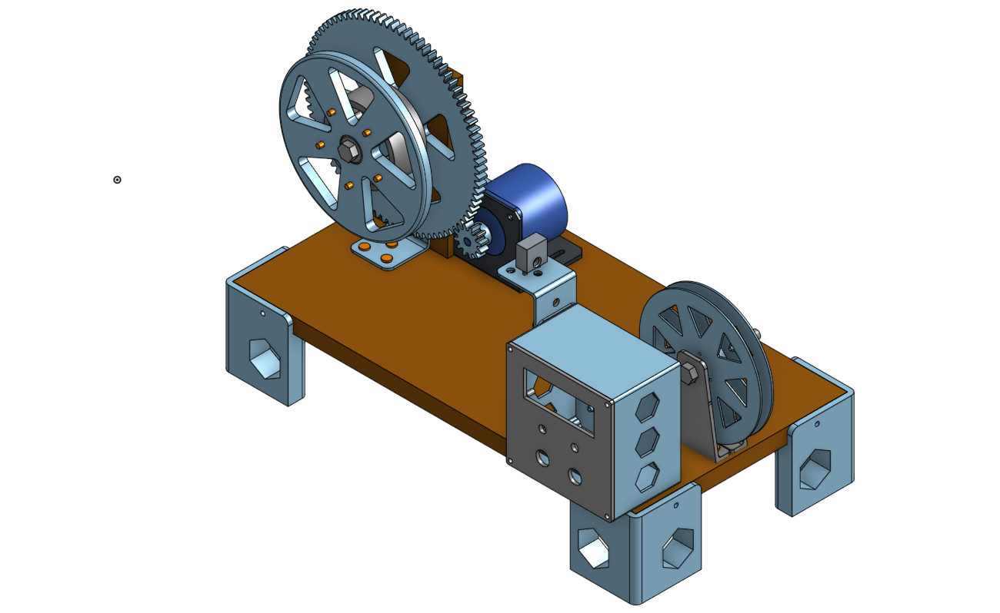

# Fila-Matic

Máquina para a fabricação de filamento para impressora 3D usando garrafas PET como matéria prima.
Inspirado pelos diversos vídeos sobre o tema, decidi fazer a minha versão de uma máquina capaz de realizar o processo de "Pultrusion" com baixo custo e utilizando componentes eletrônicos de fácil acesso.
futuramente o projeto irá ter uma placa de circuito impresso dedicado, nessa primeira versão, foi utilizado uma placa perfurada para a construção do circuito de controle.
O projeto foi criado utilisando o plugin PlatformIo do vscode com a placa arduino pro mini.

A referência sobre a montagem e peças para impressão 3d podem ser visualizadas no [link](https://cad.onshape.com/documents/5d91a331e0951ebf56f2ed7f/w/54485c1ac82f9b8ec9bbee3b/e/b9478f63aa2d556822cc66c6?renderMode=0&uiState=670570a1162fc00b95a82c7f)

Os arquivos para a impressão estão disponíveis na pasta STL.

O processo inicial para a preparação das garrafas e fabricação do cortador pode ser encontrado nesse [tutorial](https://youtu.be/a3Dar6amuzY?si=LlGIv6SwKXRhQAfx) do canal [Creatividad Y Reparación](https://www.youtube.com/c/CreatividadYReparaci%C3%B3n).

## To-Do

- Projetar placa de circuito impresso.
- Utilizar microcontrolador de mais fácil acesso e menor custo (CH32v003).
- Utilizar driver silencioso para motor de passo.
- implementar sensor de controle para o desligamento automático.
- Lista detalhada com partes nessesarias para montagem do projeto.
- Diagrama com as conexões elétricas do projeto.
